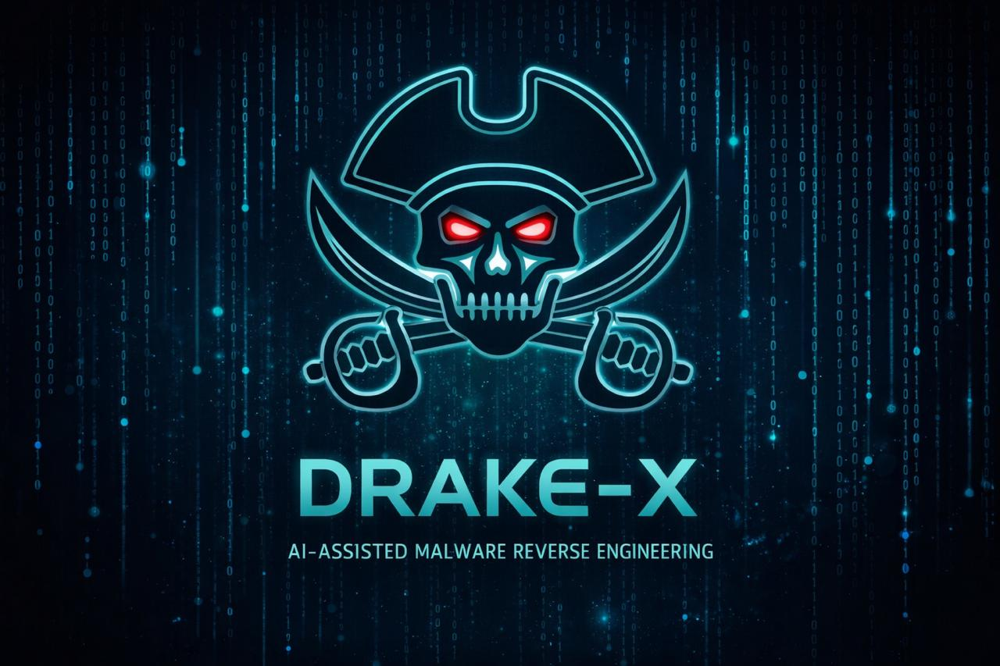

<p align="center">
  
</p>

# Drake-X

Drake-X is a local-first, evidence-driven malware analysis and threat
investigation platform for Kali Linux, with local AI assistance,
reproducible workspaces, human-in-the-loop operation, and auditable
reporting.

Drake-X structures evidence across APK/mobile malware analysis, native
binary inspection, IoC enrichment, analyst-assisted dynamic validation,
and supporting collection workflows such as recon and web inspection. It
normalizes tool output into linked artifacts, findings, indicators, and
hypotheses, then produces auditable reports that clearly separate
observed facts, external intelligence, analytic assessment, and AI-backed
inference.

Drake-X is written in Python 3. It shells out to native Kali tools as
subprocesses but contains no Kali-only Python dependencies.

## Authorized use only

> Drake-X is intended for **authorized** defensive investigation,
> malware research, and security assessment only. Only run it against
> assets or samples you are permitted to analyze. Unauthorized scanning
> or unauthorized sample handling may be illegal in your jurisdiction.

Drake-X is not an exploit framework. It does not perform exploitation,
brute forcing, credential attacks, payload generation, post-exploitation,
persistence, lateral movement, phishing, or weaponization of any kind.
The code and the AI prompts both enforce this boundary.

## Current Platform Status

Drake-X v1.0 turns the platform from a strong per-sample analysis tool
into a workspace-level evidence platform. Evidence graphs are persisted
in SQLite, queryable across the workspace, and used for cross-sample
correlation, structured validation planning, case-level reporting, and
platform-wide AI auditability.

The v0.9 PE exploit-awareness layer remains intact in v1.0: PE analysis
still detects exploit-related indicators, carves suspected shellcode
artifacts, performs bounded decoding for triage, assesses
protection-interaction, maps findings to ATT&CK, and supports
AI-assisted exploit-aware assessment with strict evidence citation.

v1.0 adds first-class ELF analysis, external evidence ingestion with
mandatory provenance, global graph query, consolidated case reporting,
and a minimal experimental jobs/queue/worker foundation.

The center of gravity is malware analysis, native inspection,
intelligence correlation, and analyst-assisted validation. Recon and web
collection remain in the platform, but as supporting evidence-gathering
domains rather than the primary product identity.

## Design Principles

- **Human-in-the-loop by design.** The operator declares scope, selects
  modules, confirms active actions, and validates every finding. Drake-X
  assists with triage and reporting — it never acts autonomously.
- **Strict operator control.** Network-facing collection workflows
  require engagement scope and confirmation. Sample analysis workflows
  remain local-first and evidence-preserving. Out-of-scope and
  unauthorized target interaction is refused by default.
- **Evidence over assumptions.** Every finding carries a `source` (rule,
  AI, parser, operator) and a `fact_or_inference` flag. Reports never
  present AI-generated interpretation as observed fact.
- **Local-first AI.** The optional LLM layer communicates only with a
  local Ollama instance on the same host. There is no remote AI client
  in the codebase. No telemetry. No cloud dependency.
- **Reproducibility and auditability.** Each workspace is a
  self-contained directory with config, scope, database, evidence, and
  an append-only audit log. Copy the directory to reproduce every
  report on another host.

## Capabilities

**Workspace model.** `~/.drake-x/workspaces/<name>/` holds
`workspace.toml`, `scope.yaml`, `drake.db` (SQLite), `runs/`, and
`audit.log`.

**Evidence model.** Structured findings, indicators, protections,
campaign-similarity assessments, imported external evidence, and
dynamic-validation hypotheses converge into a shared evidence graph
persisted in SQLite.

**Malware analysis workflows.** APK analysis, Windows PE static analysis,
ELF/native binary analysis (v1.0 first-class workflow), native binary
inspection, VirusTotal correlation, Frida observation templates,
Ghidra-backed deeper analysis, and evidence-linked reporting for
analyst review.

**Cross-sample platform capabilities (v1.0).** The Evidence Graph
persists to SQLite and is queryable workspace-wide. Operators can
correlate samples by shared indicators, imports, shellcode prefixes,
and IOC values (`drake correlate run -w …`). The default correlator
surface is tuned for analyst signal rather than raw recall: `min_shared`
defaults to `2`, universally common loader imports are suppressed, and
rarer overlaps carry more weight than workspace-wide boilerplate. Operators
can run a global node
query across every persisted graph (`drake graph query -w …`);
ingest external evidence with preserved provenance
(`drake ingest evidence …`); generate structured multi-domain
validation plans (`drake validate plan …`); and produce a
consolidated case report spanning PE, APK, ELF, and imported
evidence (`drake report case -w …`). Every AI task — not just PE
exploit assessment — runs through the shared auditable execution
path and writes a record to the workspace's `ai_audit/` directory.
A minimal SQLite-backed job/queue/worker foundation
(`drake_x.execution`) is in place and marked experimental; it is
the seam for future queue + worker deployments.

**PE analysis (v0.9).** `drake pe analyze sample.exe` parses PE headers,
sections, imports, exports, and resources. Assesses protection status
(ASLR, DEP, CFG, SafeSEH, GS), classifies import risk with ATT&CK
mapping, detects structural anomalies, identifies exploit-related
indicators, carves suspected shellcode artifacts, performs bounded
decoding for classification triage, and assesses protection-interaction.
Produces a structured technical report with exploit-awareness sections.
`pefile` and `capstone` are optional and degrade gracefully when absent.

v0.9 also writes the PE analysis onto the **Evidence Graph** as its
canonical integration bus (`pe_graph.json`) with node-ID evidence refs
linking indicators to supporting imports, sections, and protections.
With `--ai-exploit-assessment` an opt-in, locally-hosted Ollama model
produces a bounded, graph-retrieved exploit-capability assessment; every
call is recorded in an append-only audit log under `ai_audit/`
(`docs/ai-auditability.md`). With `--detection-output` Drake-X emits
**candidate** YARA rules and a STIX 2.1 bundle for analyst review
(`docs/detection-outputs.md`); rules are never presented as validated
detections.

**Scope enforcement.** Operator-declared in-scope and out-of-scope
network assets (domain, wildcard, IP, CIDR, URL prefix). Out-of-scope
rules always win. Targets matching no in-scope rule are denied by
default.

**Supporting collection modules.** `recon_passive`, `recon_active`,
`web_inspect`, `tls_inspect`, `headers_audit`, `content_discovery`,
`api_inventory`.

**Integrations.** Built-in: nmap, dig, whois, whatweb, nikto, curl,
sslscan. Real optional: httpx, ffuf, subfinder. Stubs for future work:
amass, naabu, dnsx, nuclei, feroxbuster, eyewitness, testssl.

**Mission workflows.** `drake mission run web/recon/apk/full <target>`
orchestrates multi-step evidence collection and analysis with progress
output, scope enforcement, and confirmation gating. See
[`docs/ux-layer.md`](docs/ux-layer.md).

**AI Assist.** `drake assist start <domain> <target>` provides a guided
AI loop that suggests evidence-backed next investigative steps,
explains reasoning, and executes only with operator confirmation.

**Flow navigation.** `drake flow` provides interactive menu-based
navigation for operators who prefer not to memorize subcommand names.

**Persistent console.** `drake console` opens a workspace-aware
investigation console with persistent workspace/session context, a
single banner render, and command dispatch over the existing CLI
surface.

**Workspace observability.** `drake status` shows workspace info, scope
summary, session history, findings severity breakdown, evidence graph
stats, and tool availability in a single read-only command.

**Audit-logged assist sessions.** Every Assist Mode suggest/confirm/
execute/skip step is persisted. Review with `drake assist history` or
export with `drake assist export`.

**Custom mission templates.** Define operator workflows as TOML files
in `<workspace>/missions/`. List, show, and execute with full scope
enforcement. See [`docs/operator-control.md`](docs/operator-control.md).

**Security headers audit.** Rule-based findings for missing HSTS, CSP,
X-Frame-Options, X-Content-Type-Options, Referrer-Policy, cookie flags,
and server version leaks. Each tagged with CWE and OWASP references.

**Rate limiter.** HTTP-style integrations respect per-host pacing and a
global concurrency budget, both configurable in the scope file.

**Findings model.** CWE / OWASP / MITRE ATT&CK references, evidence
backrefs, fact vs inference flag, remediation placeholders, operator tags.

**Local AI assistance.** File-based prompts and task classes:
`summarize`, `classify`, `next_steps`, `observations`, `report_draft`,
`dedupe`. All tasks run against stored artifacts — they never invoke
tools.

**Reporting.** Five per-session output formats remain available:
technical Markdown, executive Markdown, JSON, scan manifest, and
evidence index. v1.0 also adds `drake report case` for a consolidated
multi-domain case report spanning persisted sessions, correlations, and
validation plans.

**API inventory.** Parses operator-supplied OpenAPI/Swagger specs into
structured endpoint inventories without making network calls. Useful as
supporting context for threat investigation.

**APK malware analysis.** Dedicated pipeline for Android malware
analysis: manifest parsing, permission auditing, behavior detection,
obfuscation assessment, protection detection, campaign similarity,
VirusTotal enrichment, Frida dynamic-validation targets, optional Ghidra
deeper analysis, and a structured technical report. See
[`docs/apk-analysis.md`](docs/apk-analysis.md).

**Evidence Graph.** Structured relationships between findings, artifacts,
indicators, and assessments. Nodes carry domain, kind, and provenance.
Edges encode derived_from, supports, related_to, and duplicate_of
relationships. Graphs are persisted in SQLite per session, queryable via
`drake graph show` and `drake graph query`, and consumed by AI tasks for
graph-aware reasoning.
See [`docs/evidence-model.md`](docs/evidence-model.md).

**Auditability.** Every plan, run, denial, confirmation, and completion
event is appended as a JSON line to `<workspace>/audit.log`. The
engagement scope is snapshotted into the database at the start of each
session.

## Installation (Kali Linux)

```bash
sudo apt update
sudo apt install -y python3 python3-venv python3-pip \
                    nmap dnsutils whois whatweb nikto curl sslscan

git clone https://github.com/PauloBernardo90/Drake-X.git
cd Drake-X
python3 -m venv .venv
source .venv/bin/activate
pip install -e ".[dev]"
```

Verify:

```bash
drake --help
drake tools
```

See [`docs/kali-setup.md`](docs/kali-setup.md) for the full walkthrough.

## Local LLM (optional)

Drake-X never sends data to a remote provider. For local AI assistance,
run [Ollama](https://ollama.com/) on the same host:

```bash
curl -fsSL https://ollama.com/install.sh | sh
ollama pull llama3.2:1b
ollama serve &
drake ai status -w my-engagement
```

See [`docs/llm-setup.md`](docs/llm-setup.md) for model selection and
prompt customization.

## Quick tour

```bash
# Initialize a workspace
drake init my-engagement

# Define the engagement scope
$EDITOR ~/.drake-x/workspaces/my-engagement/scope.yaml
drake scope validate -w my-engagement
drake scope check example.com -w my-engagement

# Plan and execute supporting passive recon
drake recon plan example.com -m recon_passive -w my-engagement
drake recon run  example.com -m recon_passive -w my-engagement

# Execute active recon (requires scope.allow_active=true)
drake recon run example.com -m recon_active -w my-engagement --yes

# Ingest an OpenAPI spec
drake api ingest /path/to/openapi.json -w my-engagement

# Malware analysis of an Android APK
drake apk analyze sample.apk -o ./apk-output --vt --ghidra

# Malware analysis of a Windows PE sample
drake pe analyze sample.exe -w my-engagement --vt

# Malware analysis of an ELF/native sample
drake elf analyze sample.elf -w my-engagement

# Correlate sessions across the workspace
drake correlate run -w my-engagement

# Query persisted graph nodes across the workspace
drake graph query -w my-engagement --kind indicator --domain pe

# Register and ingest external evidence with mandatory provenance
drake ingest register-producer sandbox-prod -w my-engagement --trust high
drake ingest evidence ./sandbox.json -w my-engagement --type json

# Merge into an analysis session only if the workspace policy explicitly
# allows it; release workspaces default to blocking this operation
drake ingest evidence ./sandbox.json -w my-engagement --session <session-id> \
  --merge-into-analysis

# Build and export a validation plan
drake validate plan <session-id> -w my-engagement
drake validate export <session-id> -w my-engagement -o validation_plan.md

# Enter the persistent investigation console
drake console

# Generate reports
drake report generate <session-id> -f md        -w my-engagement
drake report generate <session-id> -f json      -w my-engagement
drake report generate <session-id> -f executive -w my-engagement
drake report generate <session-id> -f manifest  -w my-engagement
drake report case -w my-engagement -o case_report.md

# Compare two sessions
drake report diff <session-a> <session-b> -w my-engagement

# Explore the evidence graph
drake graph show <session-id> -w my-engagement
drake graph show <session-id> -w my-engagement --format summary
drake graph show <session-id> -w my-engagement --node <node-id> --depth 2
drake graph show <session-id> -w my-engagement --findings --format json

# Run AI tasks (requires Ollama) — graph-aware when graph is present
drake ai summarize    <session-id> -w my-engagement
drake ai classify     <session-id> -w my-engagement
drake ai dedupe       <session-id> -w my-engagement --apply

# Inspect findings
drake findings list -w my-engagement
drake findings show <finding-id> -w my-engagement
```

See [`docs/usage.md`](docs/usage.md) for the full walkthrough.
For a compact command reference, see [`docs/cheat-sheet.md`](docs/cheat-sheet.md).

## Documentation

- [`docs/README.md`](docs/README.md) — documentation index
- [`docs/drake-unleashed.md`](docs/drake-unleashed.md) — guided platform overview and operator-facing tour
- [`docs/cheat-sheet.md`](docs/cheat-sheet.md) — compact CLI command reference
- [`docs/usage.md`](docs/usage.md) — end-to-end usage walkthrough
- [`docs/kali-setup.md`](docs/kali-setup.md) — Kali installation and setup
- [`docs/llm-setup.md`](docs/llm-setup.md) — Ollama and local AI configuration
- [`docs/architecture.md`](docs/architecture.md) — architecture and package layout
- [`docs/safety.md`](docs/safety.md) — safety and scope enforcement

## Safety

Drake-X enforces every action through four layers:

1. **Target validation** — refuses loopback, link-local, multicast,
   reserved ranges, and excessively broad CIDRs regardless of scope.
2. **Engagement scope** — out-of-scope rules win; unmatched targets are
   denied by default.
3. **Action policy** — every integration is classified as passive, light,
   active, or intrusive. Active and intrusive integrations require
   `scope.allow_active=true`.
4. **Confirmation gate** — active and intrusive integrations prompt the
   operator for confirmation. `--dry-run` plans without executing.

Every event is recorded in the append-only audit log. See
[`docs/safety.md`](docs/safety.md) for the complete safety model.

## Development

```bash
pip install -e ".[dev]"
pytest -q
ruff check drake_x tests
ruff format drake_x tests
```

See [`docs/architecture.md`](docs/architecture.md) for the package
layout, engine lifecycle, storage schema, and extension guide.
For a quick CLI reference, see [`docs/cheat-sheet.md`](docs/cheat-sheet.md).

## Non-goals

Drake-X does not and will not implement:

- Exploit execution or Metasploit integration
- Brute forcing or credential attacks
- SQL injection, XSS, SSRF, CSRF, or RCE testing
- Lateral movement, persistence, or privilege escalation
- Phishing or malware simulation
- Autonomous agent loops that execute arbitrary commands
- Telemetry or network calls to remote AI providers
